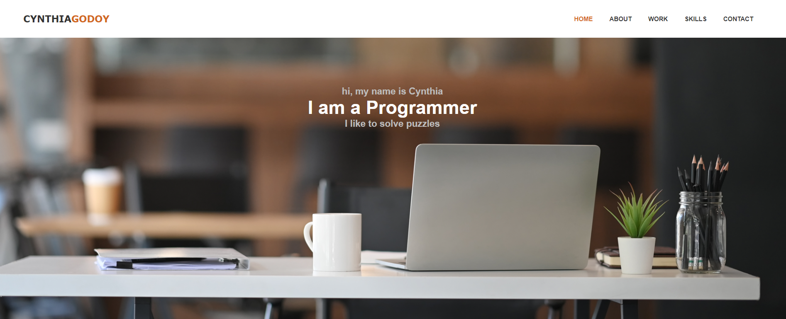

# 02 Advanced CSS: Portfolio

## Project Description

Apply flex-box, media queries, and CSS variables in a deployed portfolio page that will eventually link to other deployed projects.

## Main Objective

Build a portfolio page from scratch to showcase skills and talents to employers looking to fill a part-time or full-time position. 

## Items completed in Project

✅When Portfolio is launched, developer's name, recent photo, contact info, and sections about them and their work are easy to access.

✅Navbar UI scrolls to the corresponding section. Home, About, Work, Skills and Contact.

✅Included in the work section is a CSS grid with first image being larger in size than the other 

✅When images are clicked, it deploys to other applications/deployed work.

✅The page works with various screen sizes and is a responsive layout that adapts to a viewport size.

✅Repository contains multiple descriptive commit messages, contains a README with a link to deployed project, and Screenshot.

## Live URL
https://cynthiagodoy.github.io/Portfolio/

## Screenshot

